# Pacific BioArchive: Team Report

**Unit:** FIT5225 Assignment 2  
**Team:** Group 13
**Repository:** [03xf/FIT5225-Assessment-2](https://github.com/03xf/FIT5225-Assessment-2) (private repository; teaching staff must be invited before submission)

## 1. System overview and design choices

Pacific BioArchive is an authenticated, multi-cloud wildlife-media archive. AWS provides Cognito, API Gateway, Lambda, S3, DynamoDB, SQS and SNS. Alibaba Cloud provides a private Function Compute worker and protected OSS model artifacts. This split keeps identity, durable metadata and user-facing APIs in AWS while placing the supplied, dependency-heavy MegaDetector/SpeciesNet runtime in a service suited to a large container. Uploads are asynchronous through SQS, so the API remains responsive; query-by-file is synchronous and has a 300-second API timeout to accommodate worker cold start. Private object storage and short-lived signed URLs reduce exposure, while the additional cloud boundary demonstrates portability and controlled trust between providers.

## 2. Multi-cloud architecture

Figure 1 shows the deployed AWS/Alibaba Cloud service boundary and request flow. It uses embedded AWS Architecture Icons and Alibaba Cloud product icons while keeping the service labels, layout and trust boundaries readable for marking.

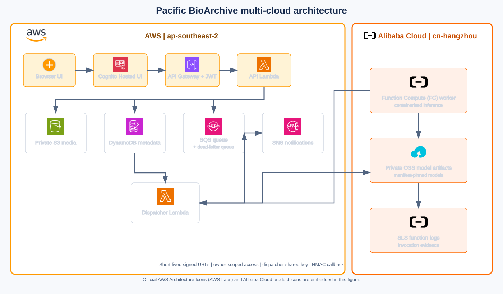
*Figure 1. Multi-cloud architecture showing the AWS and Alibaba Cloud service boundary and signed processing flow.*

```text
Browser -> Cognito Hosted UI -> API Gateway (JWT) -> API Lambda
                         |             |-- DynamoDB owner metadata/tag index
                         |             |-- private S3 raw + thumbnail objects
                         |             `-- SQS -> dispatcher Lambda
                         |                           -> signed request -> Alibaba FC worker
                         |                                                  |-> private OSS models
                         |                                                  `-> HMAC callback -> API Lambda -> DynamoDB/SNS
```

The browser calculates SHA-256 and receives no long-lived cloud credentials or worker URL. API Gateway rejects unauthenticated `/api/*` requests. Lambda roles are scoped to required prefixes and services; the worker requires a dispatcher-only shared key and signs callbacks with HMAC. The complete trust-boundary description is in [ARCHITECTURE.md](ARCHITECTURE.md).

## 3. Functional implementation and testing guide

1. Open the deployed UI at `https://7ijuyi2q17.execute-api.ap-southeast-2.amazonaws.com/`, register and verify a Cognito account, then demonstrate sign-in, sign-out and anonymous `/api/media` rejection (HTTP 401).
2. Upload `Bos_taurus_1.JPG`. The browser computes SHA-256, a checksum-bound presigned S3 PUT is completed, and DynamoDB records the owner-scoped item. Uploading the identical file again returns the existing media ID without a second object or item.
3. Upload the supplied `video.mp4`. The worker samples one frame per second, creates an aspect-preserving thumbnail, verifies the manifest-pinned model hashes, and writes aggregate tags. The record reached `READY` with model version `supplied-2026-08`; live FC evidence is in [function-compute-sls-20260830.md](evidence/function-compute-sls-20260830.md).
4. Run a single-species search and an AND query such as `felis_catus:1, bos_taurus:1`; only records satisfying every term and minimum count are returned. Resolve a thumbnail URL while authenticated and repeat as another user to demonstrate owner isolation.
5. Submit an image through query-by-file. Results are returned from a TTL-bound temporary prefix; no media item is added and the temporary object is removed after processing.
6. Select multiple records, add and remove a temporary tag, then delete a selected test record. Verify both S3 source/thumbnail prefixes and the DynamoDB item before and after; re-upload the test image only after the evidence capture.
7. Subscribe to `felis_catus`, confirm the SNS email, and upload/tag matching media. The notification screenshot and all workflow screenshots are indexed in [evidence/README.md](evidence/README.md).

## 4. Evidence and limitations

The deployed AWS region is `ap-southeast-2`; the Alibaba region is `cn-hangzhou`; the worker is `pacificbio-worker`. The local regression suite passes **16 tests**. Evidence includes Cognito authentication, anonymous rejection, checksum deduplication, video readiness, AND/species queries, thumbnail ownership, query-by-file cleanup, bulk tags, deletion/restoration, SNS confirmation, storage/database state and real SLS invocation logs. The current image scan still reports upstream base-layer vulnerabilities (`CRITICAL=4` and `HIGH` findings), so the final submission must either rebuild on remediated bases or record an explicit, justified risk decision. The SQS DLQ also contains three historical failed messages and should be reviewed before the final recording. No accuracy percentage is claimed because a measured 30-image evaluation has not been completed.

### Selected rubric evidence

The following screenshots are embedded for quick marking; the complete evidence bundle is in [evidence/README.md](evidence/README.md).

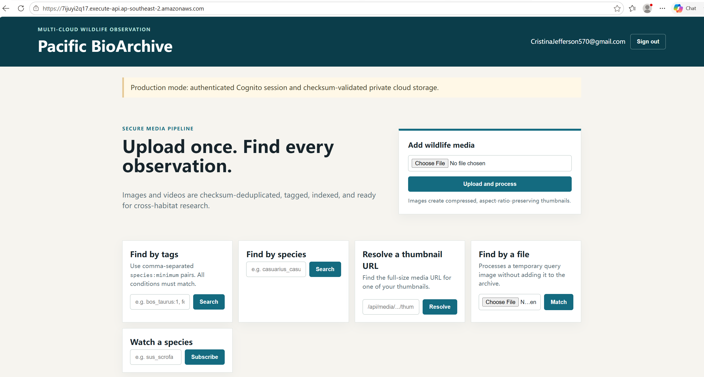
*Figure 2. Authenticated Cognito session with the owner archive loaded.*
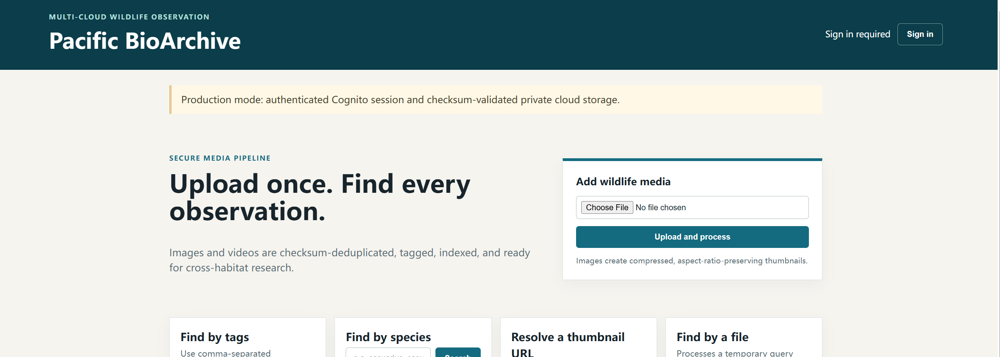
*Figure 3. Signed-out state showing the UI without an authenticated session.*
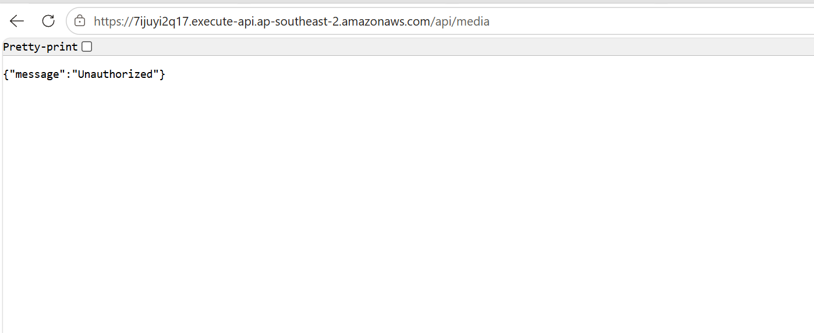
*Figure 4. Anonymous request to `/api/media` rejected with HTTP 401.*
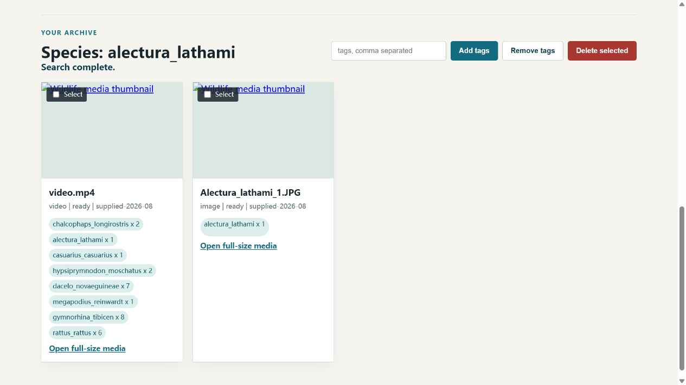
*Figure 5. Video record in READY state with generated species tags.*
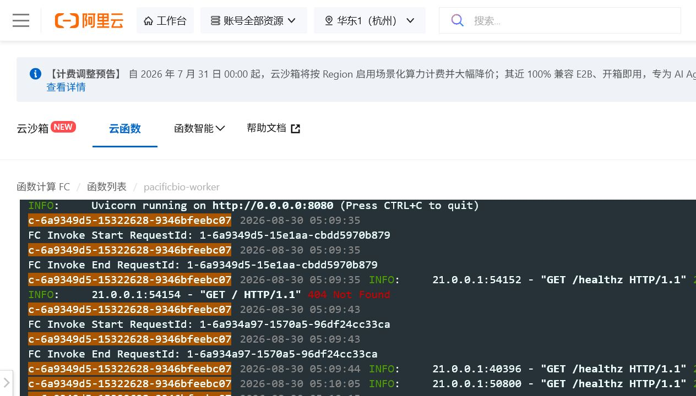
*Figure 6. Alibaba Function Compute invocation logs recorded in SLS.*
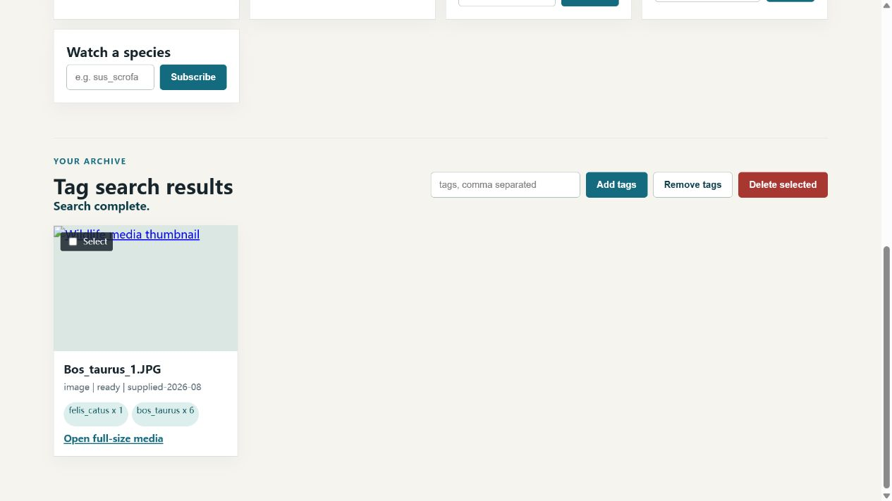
*Figure 7. AND tag query returning records matching every condition.*
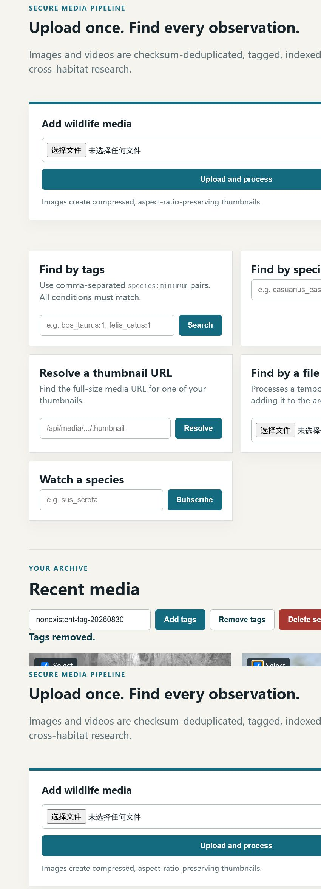
*Figure 8. Two media records selected with the bulk tag controls ready.*
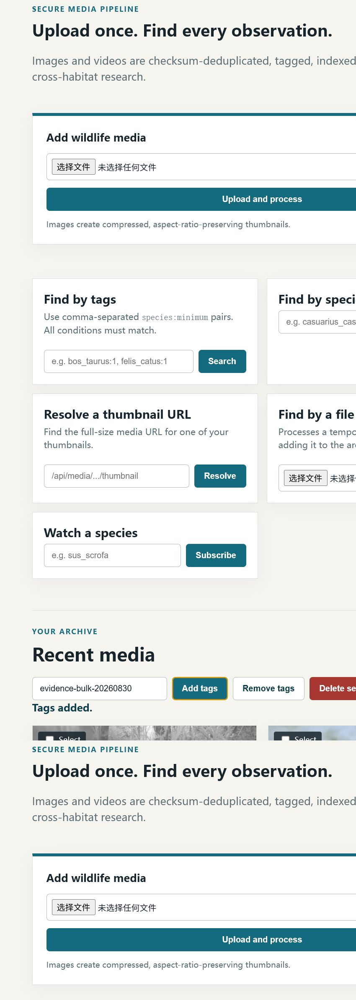
*Figure 9. The temporary evidence tag was added to both selected records and the UI reported “Tags added.”*
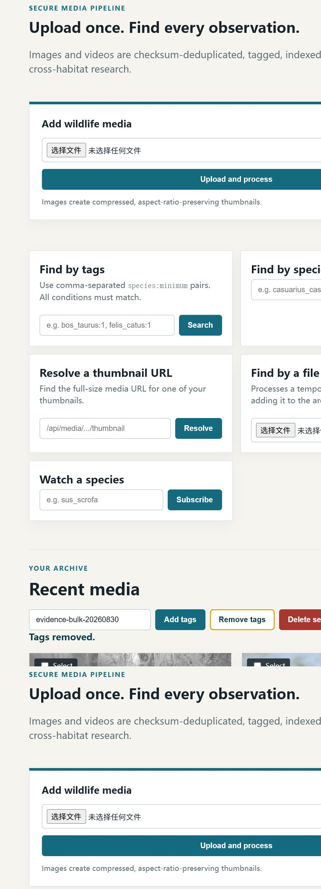
*Figure 10. The same temporary tag was removed from both selected records and the UI reported “Tags removed.”*
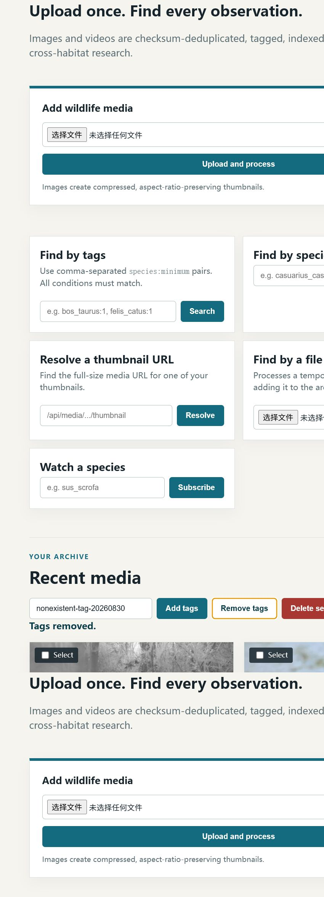
*Figure 11. Removing a non-existent tag caused no record changes; the selected records remained unchanged.*
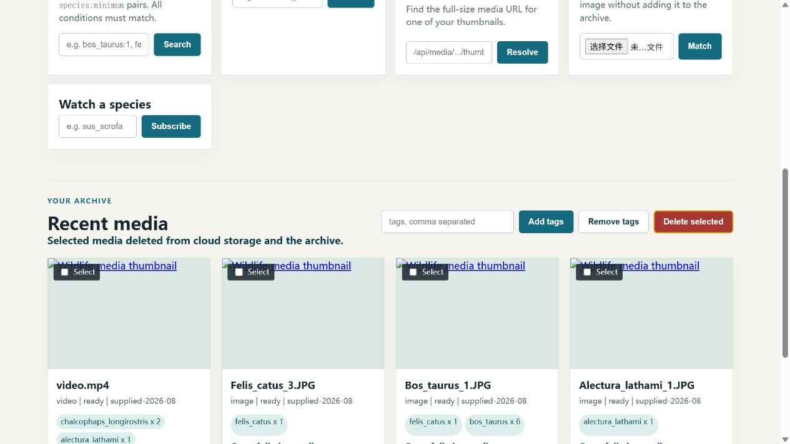
*Figure 12. Application confirmation after deleting the selected test record.*
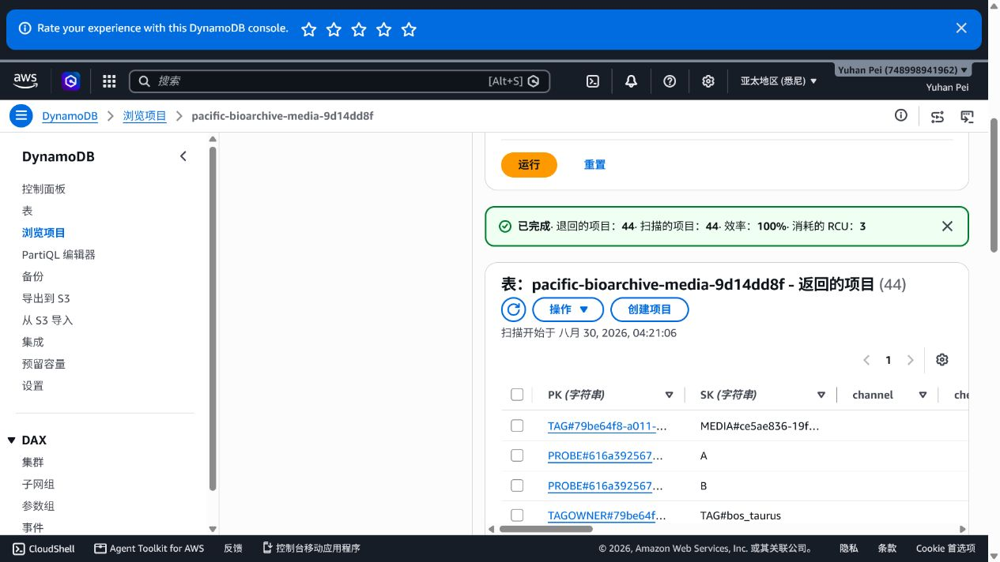
*Figure 13. DynamoDB item absent after deletion.*
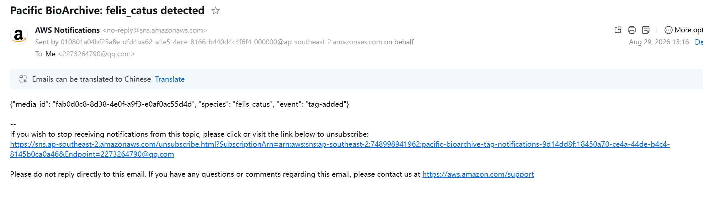
*Figure 14. Actual AWS SNS email received after the watched `felis_catus` tag was added; the payload records `event: "tag-added"`.*
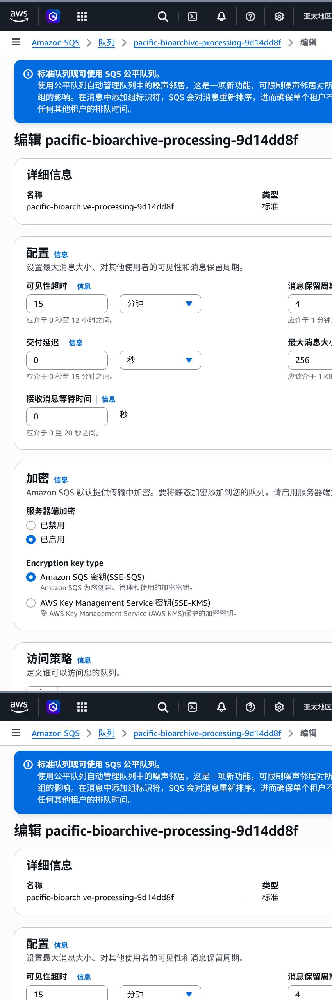
*Figure 15. AWS API Lambda role with the inline `least-privilege-media-api` policy and scoped S3, DynamoDB, SNS and SQS actions.*
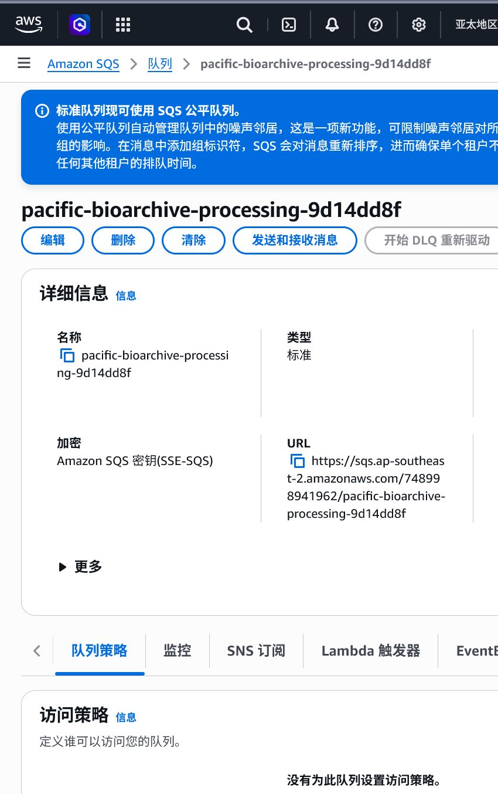
*Figure 16. AWS processing queue details showing SSE-SQS encryption and an enabled dead-letter queue.*

*Figure 17. Source queue redrive configuration: 15-minute visibility timeout, DLQ target and maximum receive count of 3.*
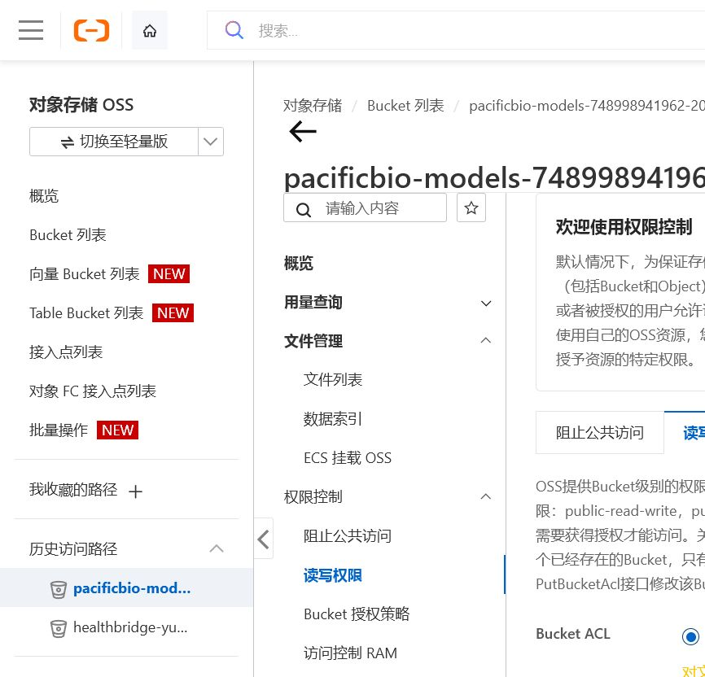
*Figure 18. Alibaba OSS model bucket `pacificbio-models-748998941962-20260828` with Bucket ACL set to Private; all object access requires authentication.*
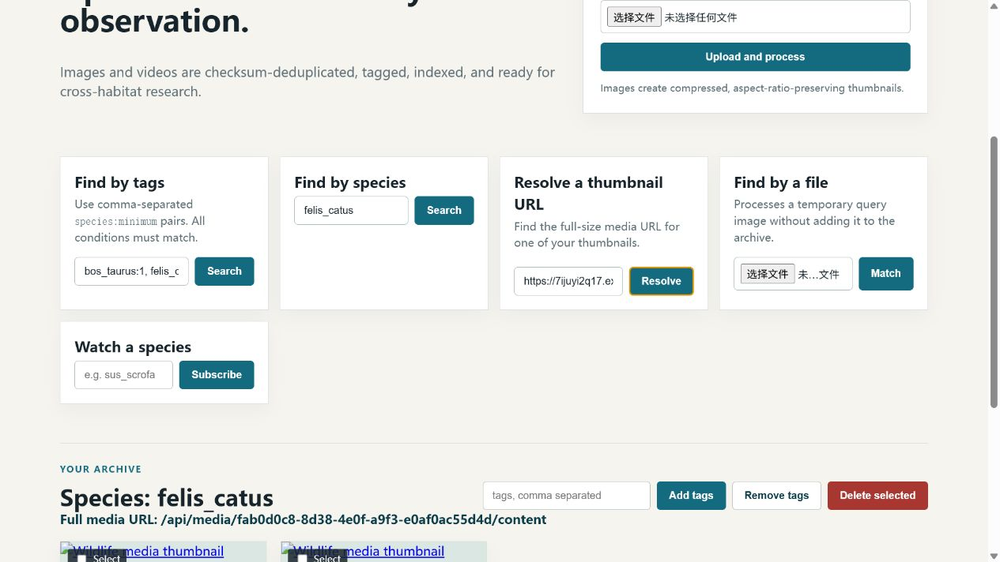
*Figure 19. Authenticated UI showing thumbnail URL resolution and the temporary query-by-file workflow; the query panel explicitly states that the image is not added to the archive.*
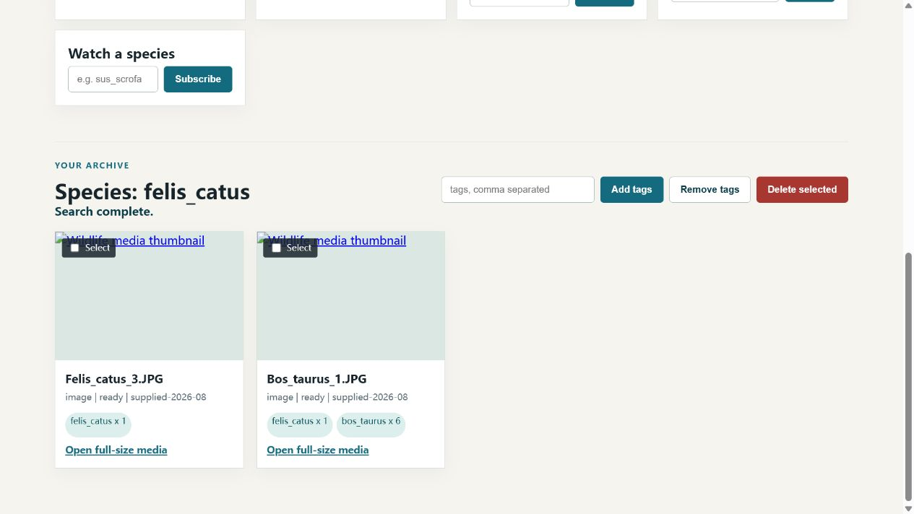
*Figure 20. Single-species search for `alectura_lathami` returning matching ready records.*
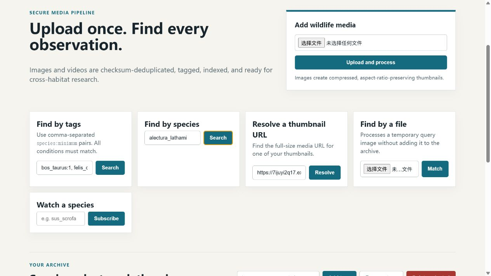
*Figure 21. Processed `video.mp4` in READY state with model version and aggregate species/count tags.*
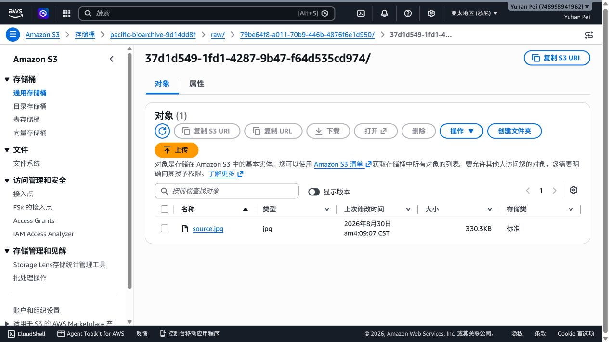
*Figure 22. S3 console before deletion showing the test source object.*
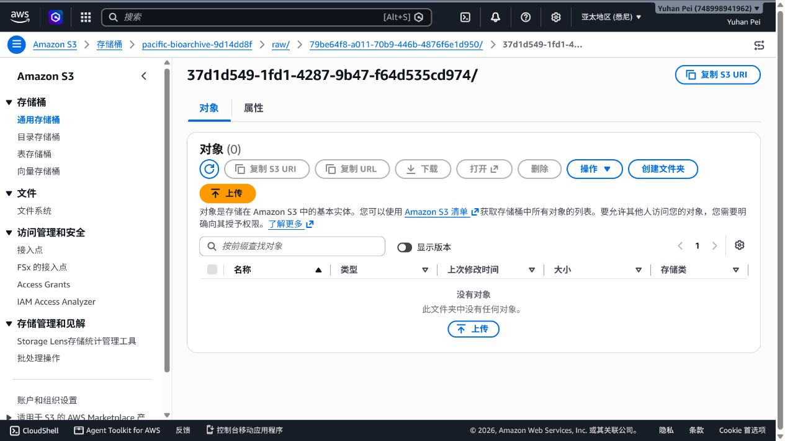
*Figure 23. S3 console after deletion showing the test source prefix empty.*

*Figure 24. Authenticated production archive banner explicitly showing checksum validation; duplicate-upload details and SHA-256 values are cross-referenced in the upload evidence record.*

## 5. Team contributions

| Name and student ID | Contribution % | Delivered work |
|---|---:|---|
| **Yuhan Pei (36667528)** | **25%** | **Member 01: API, authentication and persistence.** API contracts, Cognito/JWT authentication, owner-scoped media and DynamoDB persistence; commits are visible in the private repository. |
| **Mingyu Xu (36667277)** | **25%** | **Member 02: media and frontend workflow.** Browser UI, upload/checksum flow, search, thumbnail resolution, bulk tag and deletion workflows, and live UI evidence. |
| **Zhihao Qian (36667625)** | **25%** | **Member 03: ML worker and video processing.** Function Compute worker integration, manifest/checksum validation, image classification, video frame sampling, thumbnail generation and callback evidence. |
| **Zhicong Wang (36667676)** | **25%** | **Member 04: infrastructure and deployment.** Terraform AWS/Alibaba resources, IAM/RAM boundaries, SQS/DLQ, deployment validation, security scans and operational evidence. |

The four contribution percentages total 100%. Verify that each member's branch/commit history is visible in the private repository before submission.

## 6. Generative AI declaration

GPT was used only to brainstorm design options and to help debug implementation errors. Team members reviewed every suggestion, tested the resulting system, and can explain, modify and defend the submitted code and architecture.
